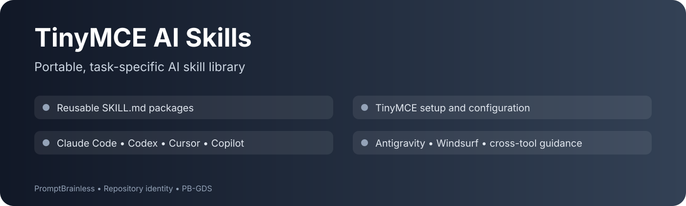

# tinymce-ai-skills

A collection of AI skills for TinyMCE products — compatible with Claude Code, Codex, Cursor, GitHub Copilot, Google Antigravity, and Windsurf.

## What is an AI skill?

An AI skill is a set of files that gives an AI assistant deep, specialised knowledge about a specific task. Add one to your AI tool of choice to unlock guided, context-aware assistance for that topic.

## Skills

| Skill | Description |
|---|---|
| [tinymce-setup](skills/tinymce-setup/SKILL.md) | Guides you through installing and configuring TinyMCE in any framework |

## Usage

### Claude Code
1. Copy the skill folder into `~/.claude/skills/` (global) or `.claude/skills/` in your project root (project-scoped)
2. Claude Code will discover the skill automatically and apply it when relevant

### Codex
1. Copy the skill folder into your project
2. Register it as a Codex Skill via `AGENTS.md` so the agent can discover and apply it automatically

### Cursor
1. Copy the skill folder into your project
2. Reference `SKILL.md` from your `.cursor/rules` file

### GitHub Copilot
1. Copy the skill folder into `.claude/skills/` in your project root
2. Copilot will discover and load it automatically when relevant — no extra configuration needed

### Google Antigravity
1. Copy the skill folder into your project
2. Reference `SKILL.md` from your `GEMINI.md` file, or from `AGENTS.md` for a cross-tool setup

### Windsurf
1. Copy the skill folder into your project
2. Reference `SKILL.md` from your `.windsurfrules` file at the project root

## Contributing

Skills are maintained by the TinyMCE team. To request a new skill or report an issue, open a GitHub issue.

---

## Repository identity

This repository uses a versioned visual cover in `docs/REPOSITORY-COVER.svg` to make its scope visible at a glance.
